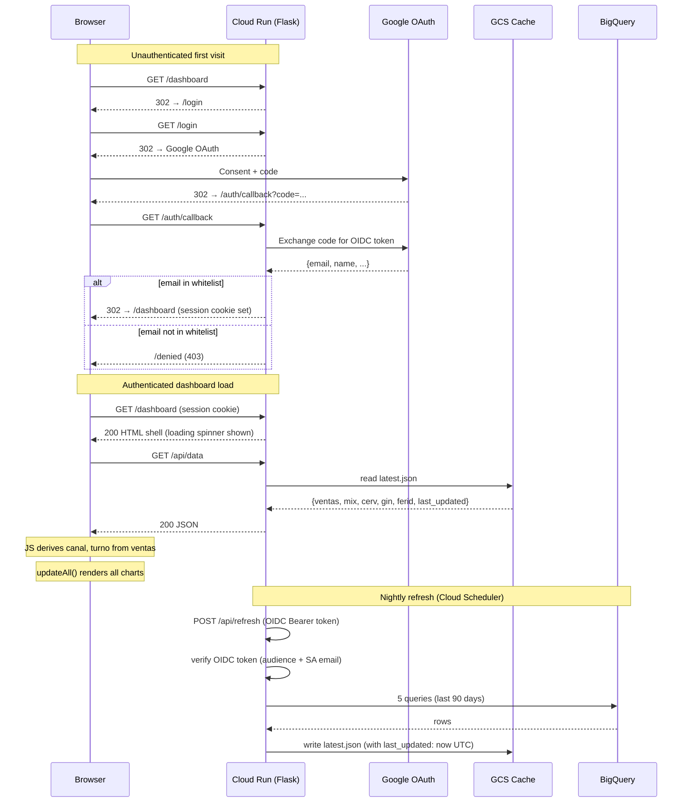

# feat: Temple Bar Dashboard — Flask Web App on Cloud Run

## Overview

Convert the self-contained HTML analytics dashboard (`super_dashboard_temple.html`) into a hosted Flask web application on GCP Cloud Run. The app will require Google OAuth login with an email whitelist, serve data via a JSON API instead of embedding it in HTML, and refresh its data nightly from BigQuery via Cloud Scheduler. A CSV export feature will be added to each dashboard tab.

The existing `actualizar_dashboard.py` data pipeline logic is reused as the core of the new refresh endpoint. The existing dashboard JS and CSS are extracted into static files with minimal changes (API fetch, loading state, establishment filter fix, CSV export).

## Problem Frame

Temple Bar receives an HTML file manually each time data is refreshed. There is no permanent URL, no access control, and no automated delivery. This creates friction for the client and limits the ability to evolve the product or reuse it for other clients.
*(see origin: docs/brainstorms/web-app-temple-bar-requirements.md)*

## Requirements Trace

- R1. Dashboard accessible via permanent URL — no file sharing
- R2. Google OAuth login required; unauthenticated visitors redirected
- R3. Only whitelisted emails can access; unauthorized accounts see /denied
- R4. Whitelist managed via config file (no admin UI in v1)
- R5. Automatic nightly data refresh via Cloud Scheduler (03:00 ART = 06:00 UTC)
- R6. Stale data served if refresh fails; visible "last updated" timestamp
- R7. Dashboard data served via /api/data endpoint, not embedded in HTML
- R8. All existing client-side filtering (date range, establishments, tabs) continues working
- R9. CSV download of filtered data per tab
- R10. CSV respects active filters; filename includes tab name and date range
- R11. BigQuery config and establishment list externalized for multi-client reuse

## Scope Boundaries

- No user management UI; whitelist changes require editing a config file and redeploying
- No real-time data updates; daily overnight refresh is sufficient
- No year-over-year comparison in this phase
- No drill-down by individual establishment in this phase
- Legacy HTML files (`dashboard_ventas_temple.html`, `tablero_ventas.html`, etc.) are not removed in this phase
- `actualizar_dashboard.py` is superseded but not deleted — keep as reference
- **Repo must remain private (hard constraint, not conditional).** `whitelist.txt` is committed to the repo and copied into the Docker image. This is acceptable for a private single-client deployment. For multi-client expansion or any scenario where the repo must be shared externally, the whitelist must first be migrated to a Secret Manager secret — that migration is out of scope here but must happen before any repo visibility change.

## Context & Research

### Relevant Code and Patterns

- `actualizar_dashboard.py`: `fetch_data(client, desde, hasta)` — reuse verbatim as pipeline core. Returns `{ventas, mix, cerveza, gin, feriado}`. Key renames needed: `cerveza` → `cerv`, `feriado` → `ferid`. Does not return `canal` or `turno` — these are derived client-side.
- `super_dashboard_temple.html` lines 542–1251: All JS is portable. The only change is replacing `const RAW = {...};` with an async `fetch('/api/data')` call. The `canal`/`turno` derivation functions are new additions.
- `super_dashboard_temple.html` lines 7–538: CSS is portable as-is into a static file.
- `super_dashboard_temple.html` lines 378–402: `#estabSelect` exists in HTML but its `onchange` handler is **missing** — this is a bug that must be fixed. Also, the `<option>` tags are hardcoded; they must be generated dynamically from the API response.
- `processed_data.json`: Used as the initial GCS cache seed on first deploy (contains `ventas`, `mix`, `cerveza`, `gin`, `feriado` — requires key renames before uploading).

### Institutional Learnings

- No `docs/solutions/` exists yet — this project has no prior solutions documented.

### External References

- **OAuth library**: `authlib` — Flask integration via `FlaskOAuth2App`, OIDC discovery from `https://accounts.google.com/.well-known/openid-configuration`
- **Session storage**: Flask signed cookies (`itsdangerous` HMAC) — session payload is ~100 bytes, no server-side session store needed
- **Cloud Run + gunicorn**: `python:3.12-slim`, 1 worker / 8 threads, `--timeout 0`
- **Cloud Run identity**: ADC via attached service account — no credential files, no `GOOGLE_APPLICATION_CREDENTIALS` in production
- **Cloud Scheduler OIDC**: `roles/run.invoker` + in-process `id_token.verify_token` — two-layer defense
- **GCS cache region**: `southamerica-east1` co-located with Cloud Run service for <30ms reads
- Sources: Google Cloud Run docs, Authlib Flask docs, Cloud Scheduler HTTP trigger docs

## Key Technical Decisions

- **Flask on Cloud Run (not static GCS)**: Enables server-side auth, API separation, and per-client config via env vars. The marginal complexity over a static approach is justified by the reuse goals.
- **authlib (not google-auth-oauthlib)**: Authlib has Flask integration, automatic OIDC discovery, and active maintenance. `google-auth-oauthlib` is designed for server-side API credential management, not user-facing login flows.
- **Signed cookie sessions (not Firestore)**: Session payload is ~100 bytes (email + name). No server-side session invalidation is needed in v1. Eliminates Firestore dependency and per-request DB reads.
- **GCS for cache (not Firestore)**: One JSON blob, nightly writes, read on every dashboard load. GCS is simpler, cheaper, and sufficient — Firestore adds NoSQL overhead with no benefit here.
- **`canal`/`turno` derived client-side**: These are pure aggregations of `ventas` by date+channel and date+shift. Deriving them in the browser avoids 2 extra BigQuery queries per nightly refresh and keeps the server response contract simpler.
- **Email whitelist via `whitelist.txt`**: A flat text file (one email per line) loaded at startup. Adding a user requires editing the file and redeploying — acceptable for v1. The whitelist is not a Secret Manager secret (not sensitive); it is committed to the repo. Constraint: repo must stay private (see Scope Boundaries).
- **`/logout` as POST with CSRF token**: Logout modifies session state. A GET `/logout` is exploitable via a simple `` tag from any third-party page. Flask-WTF `CSRFProtect` is the standard mechanism; it generates and validates a per-session CSRF token for all state-mutating routes. The logout button in the dashboard header submits a small `<form method="POST" action="/logout">` with the CSRF token included.
- **90-day data window**: Matches current behavior. The date range picker allows selecting within the available window; attempts to filter beyond 90 days silently return empty results. A UI notice documents this limit.
- **`southamerica-east1` region**: Co-locates Cloud Run, GCS, and BigQuery in the same GCP region for minimal latency. This is the Buenos Aires–adjacent region.

## Open Questions

### Resolved During Planning

- **Which OAuth library?** → `authlib`. Better Flask integration than `google-auth-oauthlib`, actively maintained, automatic OIDC discovery.
- **Session storage?** → Flask signed cookies. Payload is tiny; no server-side invalidation needed; no extra DB.
- **`canal`/`turno` in API response?** → No. Derived client-side from `ventas`. Avoids 2 extra BQ queries; the data is already available client-side.
- **GCS vs Firestore for cache?** → GCS. Single JSON blob, nightly writes, straightforward Python API.
- **Per-client config mechanism?** → Environment variables on the Cloud Run service (Cloud Run service config + Secret Manager for secrets). Changing a client = deploying a new Cloud Run service with different env vars.
- **Session TTL?** → 8 hours. JS detects 401 from `/api/data` and redirects to `/login` with `?reason=expired`.
- **Empty cache on first deploy?** → Seed GCS from `processed_data.json` as part of the deployment runbook (with key renames applied). App returns 503 with a user-visible message if cache is empty.

### Deferred to Implementation

- Exact Cloud Run service URL (needed for OIDC audience claim and OAuth redirect URI) — known only after first deploy
- Whether `bigquery.jobUser` role must be project-level or can be scoped to a dataset — verify during GCP setup
- Final `SECRET_KEY` rotation strategy — document in deploy runbook during implementation

## High-Level Technical Design

> *This illustrates the intended approach and is directional guidance for review, not implementation specification. The implementing agent should treat it as context, not code to reproduce.*



**CSV Export flow (client-side only):**
```
User filters data → clicks "Descargar CSV" on tab
  → getFiltered() returns current filtered dataset
  → JS converts rows to CSV string
  → Blob URL download triggered
  → file: templeBar_{tab}_{d1}_{d2}.csv
```

## Implementation Units

- [ ] **Unit 1: GCP Infrastructure Setup**

**Goal:** Create all GCP resources the Flask app depends on (service accounts, IAM bindings, GCS bucket, Secret Manager secrets, initial cache seed).

**Requirements:** R1, R2, R3, R5, R6, R11

**Dependencies:** None (prerequisite for all other units)

**Files:**
- Create: `deploy/setup.sh` (one-time GCP resource creation script)
- Create: `deploy/README.md` (setup instructions and deployment runbook)

**Approach:**
- Create `dashboard-sa` service account; grant `roles/bigquery.dataViewer`, `roles/bigquery.jobUser` (project-level), `roles/storage.objectAdmin` (bucket-level)
- Create `scheduler-invoker` service account; grant `roles/run.invoker` on the Cloud Run service (after deploy)
- Create GCS bucket `temple-bar-dashboard-cache` in `southamerica-east1`, Standard storage, uniform bucket-level access
- Store `OAUTH_CLIENT_SECRET` and `FLASK_SECRET_KEY` in Secret Manager; grant `dashboard-sa` access
- Seed initial GCS cache: rename keys in `processed_data.json` (`cerveza` → `cerv`, `feriado` → `ferid`), add `last_updated: "2026-04-08T00:00:00Z"`, upload as `latest.json`

**Test scenarios:**
- Test expectation: none — infrastructure setup; verify manually with `gcloud` commands

**Verification:**
- `dashboard-sa` can query `temple-bar-439715.temple_bar.Ventas_Maestra` via `bq query`
- `dashboard-sa` can read/write to GCS bucket
- `latest.json` exists in bucket and contains the 5 expected keys

---

- [ ] **Unit 2: Flask App Scaffold + Container**

**Goal:** Create the Flask app skeleton with config management, requirements, and Dockerfile.

**Requirements:** R11 (externalized config), R1 (deployable container)

**Dependencies:** Unit 1 (GCS bucket and Secret Manager secrets must exist for local `.env`)

**Files:**
- Create: `app.py`
- Create: `config.py`
- Create: `requirements.txt`
- Create: `Dockerfile`
- Create: `.dockerignore`
- Create: `whitelist.txt`
- Create: `.env.example`

**Approach:**
- `config.py` reads from env vars: `FLASK_SECRET_KEY`, `GCP_PROJECT_ID` (default `temple-bar-439715`), `BQ_DATASET_ID` (default `temple_bar`), `CACHE_BUCKET`, `OAUTH_CLIENT_ID`, `OAUTH_CLIENT_SECRET`, `SCHEDULER_SA_EMAIL`, `CLOUD_RUN_URL`. `CLOUD_RUN_URL` is **not required at startup** (the URL is unknown until after first deploy — see Unit 8). However, it **must be validated as non-empty at the start of every `/api/refresh` request** (Unit 5) — if empty, return 503 immediately without querying BigQuery. An empty `CLOUD_RUN_URL` would cause `id_token.verify_token` to skip audience validation; refusing to process the request is safer than accepting tokens with no audience check. The `.env.example` documents `CLOUD_RUN_URL` with a placeholder value.
- `config.py` loads `whitelist.txt` at import time into a `frozenset` — fast O(1) membership checks
- `requirements.txt`: `flask>=3.1`, `authlib>=1.3`, `requests>=2.31`, `google-auth>=2.28`, `google-cloud-bigquery>=3.20`, `google-cloud-storage>=2.16`, `gunicorn>=22.0`, `flask-wtf>=1.2` (for CSRF protection on `/logout`)
- `Dockerfile`: `FROM python:3.12-slim`, `COPY requirements.txt`, `RUN pip install --no-cache-dir`, `COPY . .`, non-root `appuser`, `CMD exec gunicorn --bind :$PORT --workers 1 --threads 8 --timeout 0 app:app`
- `.dockerignore`: exclude `*.html` (legacy files), `processed_data.json`, `docs/`, `*.docx`, `*.png`, `*.txt` except `whitelist.txt`, `.env*` except `.env.example`
- `SESSION_COOKIE_SECURE=True`, `SESSION_COOKIE_HTTPONLY=True`, `SESSION_COOKIE_SAMESITE='Lax'`, `PERMANENT_SESSION_LIFETIME=timedelta(hours=8)`

**Test scenarios:**
- Happy path: `docker build` completes successfully
- Happy path: `docker run -p 8080:8080 --env-file .env.local` → app starts and returns non-500 on `GET /`
- Edge: missing required env var at startup → Flask raises `RuntimeError` with a descriptive message (not a silent None)

**Verification:**
- Container builds and starts without errors
- `app.config` contains all required values when env vars are set

---

- [ ] **Unit 3: Google OAuth Login Flow**

**Goal:** Implement `/login`, `/auth/callback`, `/denied` routes and the `@login_required` decorator.

**Requirements:** R2, R3, R4

**Dependencies:** Unit 2

**Files:**
- Modify: `app.py` (auth routes, `login_required` decorator)
- Create: `templates/login.html` (minimal; displays "Iniciando sesión con Google…" then auto-redirects)
- Create: `templates/denied.html` (403 page with "Iniciar sesión con otra cuenta" button)
- Create: `tests/test_auth.py`

**Approach:**
- `authlib.integrations.flask_client.OAuth` registered with Google OIDC: `server_metadata_url='https://accounts.google.com/.well-known/openid-configuration'`, `client_kwargs={'scope': 'openid email profile'}`
- `/login`: calls `oauth.google.authorize_redirect(callback_url)`. For the "try another account" path, add `prompt='select_account'` query param.
- `/auth/callback`: exchanges code for OIDC token, extracts `email` from `token['userinfo']`. If email not in `config.WHITELIST` → redirect `/denied`. Otherwise → `session['user'] = {email, name}`, `session.permanent = True`, redirect `/dashboard`.
- `/logout`: **POST only**, protected by Flask-WTF CSRF token. Clears session, redirects `/login`. The dashboard header logout button submits `<form method="POST" action="/logout">` with the CSRF token included. A GET `/logout` is vulnerable to CSRF logout via `` on any external page.
- `@login_required` decorator: checks `session.get('user')`. If missing → for API routes returns `{"error": "unauthorized"}` with status 401; for HTML routes → `redirect(url_for('login'))`. The 401 JSON path is critical: it lets the JS `fetch` handler detect session expiry without misinterpreting an HTML redirect as data.
- `/denied`: renders `denied.html` with a link back to `/login?prompt=select_account`.

**Test scenarios:**
- Happy path: whitelisted email in callback → session created → 302 to `/dashboard`
- Edge: non-whitelisted email → 302 to `/denied`
- Edge: `/dashboard` request with no session → 302 to `/login`
- Edge: `GET /api/data` with no session → 401 JSON `{"error": "unauthorized"}` (not HTML redirect)
- Edge: OAuth callback with `error` param (user cancelled) → error page shown
- Edge: session still set 7 hours after login → dashboard accessible
- Edge: session expired (> 8 hours) → `GET /api/data` returns 401
- Integration: `/login` → Google OIDC redirect URL contains correct `client_id`, `redirect_uri`, `scope`

**Verification:**
- Browser: login with whitelisted account → lands on `/dashboard`
- Browser: login with non-whitelisted account → lands on `/denied` with "try another account" link
- `curl /api/data` without cookie → `{"error": "unauthorized"}` HTTP 401

---

- [ ] **Unit 4: GCS Cache Layer + /api/data Endpoint**

**Goal:** Implement `cache.py` (GCS read/write) and the `/api/data` route that serves the cached JSON.

**Requirements:** R6, R7, R8

**Dependencies:** Units 2, 3

**Files:**
- Create: `cache.py`
- Modify: `app.py` (add `/api/data` route)
- Create: `tests/test_cache.py`

**Approach:**
- `cache.py`:
  - `gcs_client = storage.Client()` initialized at module level (reused across requests)
  - `read_cache() -> dict | None`: reads `latest.json` from `config.CACHE_BUCKET`; returns `None` if blob not found or on read error
  - `write_cache(data: dict) -> None`: serializes to JSON and uploads to `latest.json` with `content_type='application/json'`; raises on failure (caller handles)
  - Neither function catches all exceptions silently — callers decide error behavior
- `/api/data` route: `@login_required`. Calls `read_cache()`. If `None` → 503 `{"error": "data not yet available"}`. Otherwise → `jsonify(data)` with `Content-Type: application/json`.
- Response shape: `{ventas:[{d,e,c,t,o,v,tk},...], mix:[...], cerv:[...], gin:[...], ferid:[...], last_updated:"2026-04-08T06:00:00Z"}`. **No `canal` or `turno` keys** — these are derived client-side.
- `gcs_client` initialized once; `storage.Client()` uses ADC automatically.

**Test scenarios:**
- Happy path: cache contains valid JSON → `/api/data` returns 200 with all expected keys
- Happy path: `last_updated` field is present in response
- Edge: cache blob does not exist → `/api/data` returns 503 with descriptive error
- Edge: GCS unavailable (connection error) → `/api/data` returns 503; error logged
- Edge: `/api/data` without session → 401 (covered by `login_required`)
- Unit: `read_cache()` with mock GCS client returning valid JSON → correct dict returned
- Unit: `read_cache()` with mock blob.exists() returning False → returns None
- Unit: `write_cache(data)` with mock GCS → verifies bucket name, blob key (`latest.json`), content-type

**Verification:**
- With seeded cache in GCS: `curl -H "Cookie: session=..." /api/data` → 200 JSON with `ventas`, `mix`, `cerv`, `gin`, `ferid`, `last_updated`
- Cache blob missing: returns 503

---

- [ ] **Unit 5: BigQuery Refresh Endpoint**

**Goal:** `/api/refresh` endpoint that re-queries BigQuery and atomically updates the GCS cache, secured with OIDC token verification.

**Requirements:** R5, R6

**Dependencies:** Units 2, 4

**Files:**
- Create: `pipeline.py` (adapted `fetch_data` from `actualizar_dashboard.py`)
- Modify: `app.py` (add `/api/refresh` route, `require_scheduler` decorator)
- Create: `tests/test_pipeline.py`

**Approach:**
- `pipeline.py`: Copy `fetch_data(client, desde, hasta)` from `actualizar_dashboard.py`. Change return key `cerveza` → `cerv`, `feriado` → `ferid`. Remove CLI-specific code. The `bq_client` is passed in (not created inside the function) for testability.
- `require_scheduler` decorator in `app.py`: first checks that `config.CLOUD_RUN_URL` is non-empty — if not, returns 503 immediately (do not call `verify_token` with an empty audience). Then extracts `Authorization: Bearer <token>` header. Calls `google.oauth2.id_token.verify_token(token, google.auth.transport.requests.Request(), audience=config.CLOUD_RUN_URL)`. Checks `claims['email'] == config.SCHEDULER_SA_EMAIL`. Returns 401/403 on any failure.
- `/api/refresh` route: `@require_scheduler`. Computes `desde = today − 90 days`, `hasta = today`. Calls `pipeline.fetch_data(bq_client, desde, hasta)` → adds `last_updated: utcnow().isoformat() + 'Z'` to result → calls `cache.write_cache(result)`. On BigQuery failure: returns 500, does not touch existing cache. On GCS write failure after successful BQ fetch: returns 500, logs the error with partial data.
- `bq_client = bigquery.Client(project=config.GCP_PROJECT_ID)` initialized at module level.
- The 90-day window is hardcoded (matches current behavior; documented in UI as a data limit).

**Test scenarios:**
- Happy path: valid OIDC token + BQ returns data + GCS write succeeds → 200 `{"status": "ok", "records": N}`
- Error: missing Authorization header → 401
- Error: invalid/expired OIDC token → 401
- Error: valid token but wrong SA email → 403
- Error: BigQuery raises exception → 500; existing cache untouched (verify by reading cache before/after)
- Edge: Cloud Scheduler fires twice simultaneously → two writes, last one wins (idempotent; no partial data risk since write is atomic for GCS blob replacement)
- Unit: `pipeline.fetch_data` with mock `bigquery.Client` → returned dict has keys `ventas`, `mix`, `cerv`, `gin`, `ferid` (correct renames)
- Unit: result dict does NOT contain `cerveza` or `feriado` keys (verify rename)
- Integration: Cloud Scheduler manual trigger → GCS `latest.json` updated with today's `last_updated`

**Verification:**
- `gcloud scheduler jobs run nightly-refresh --location southamerica-east1` → Cloud Run logs show successful BQ queries and GCS write
- `gsutil stat gs://temple-bar-dashboard-cache/latest.json` → `last_updated` updated to current time

---

- [ ] **Unit 6: Frontend Dashboard Adaptation**

**Goal:** Convert `super_dashboard_temple.html` into Flask/Jinja2 template. Replace embedded data with API fetch. Fix establishment filter bug. Add loading state and 401 detection.

**Requirements:** R1, R7, R8

**Dependencies:** Units 3, 4

**Files:**
- Create: `templates/dashboard.html` (Jinja2 template, adapted from `super_dashboard_temple.html`)
- Create: `static/dashboard.css` (extracted CSS from HTML, unchanged)
- Create: `static/dashboard.js` (extracted + modified JS)
- Modify: `app.py` (add `GET /dashboard` route)
- Create: `tests/test_dashboard.py` (Flask route tests)

**Approach:**

**`app.py` route:** `@login_required`. Renders `dashboard.html` passing `user=session['user']` for the header user display.

**`static/dashboard.css`:** Move the entire `<style>` block (lines 7–538 of `super_dashboard_temple.html`) verbatim into this file. No changes needed.

**`templates/dashboard.html`:** Keep all HTML markup structure. Changes:
- Replace `<link>` and `<script>` CDN tags to reference `static/dashboard.css` and `static/dashboard.js`
- Remove `const RAW = {...};` line entirely
- Remove hardcoded `<option>` tags in `#estabSelect` — leave empty `<select id="estabSelect">` (options built dynamically by JS)
- Add a loading overlay element (spinner, shown until data loads)
- Add a data-limit notice below the date picker: "Datos disponibles: últimos 90 días"
- Add `{{ user.name }}` display in header (from Jinja2 context)
- Add logout link to header

**`static/dashboard.js`:** Move the entire `<script>` block. Changes:
1. Replace `const RAW = {...};` with an `initData()` async function:
   - Show loading overlay
   - `fetch('/api/data')` — if response is 401 → `window.location.href = '/login?reason=expired'`
   - On success → `window.RAW = data` → derive `canal` and `turno` → hide overlay → `updateAll()`
   - On network error → hide overlay → show error banner
2. Add `deriveCanal(ventas)` function: groups `ventas` rows by `{d, c}`, sums `o` and `v` per group, returns array of `{d, c, o, v}`
3. Add `deriveTurno(ventas)` function: groups `ventas` rows by `{d, t}`, sums `o`, `v`, `tk` per group, returns array of `{d, t, o, v, tk}`
4. Build `#estabSelect` options dynamically: extract distinct `e` values from `RAW.ventas`, sort alphabetically, add "Todos" as first option
5. Add missing `#estabSelect` `change` event handler: `state.estab = e.target.value; updateAll()`
6. Add `last_updated` display in header: parse ISO string, convert to `America/Buenos_Aires` timezone via `Intl.DateTimeFormat`, show as "Última actualización: DD/MM/YYYY HH:mm"
7. Update `DOMContentLoaded`: replace `setTimeout(updateAll, 100)` with `initData()` call
8. Keep all other functions (`getFiltered`, `getPrevFiltered`, `makeChart`, all `update*` functions, `initDarkMode`, `initDatePicker`, `initTabs`) unchanged

**Patterns to follow:**
- Existing `makeChart(id, config)` pattern for chart lifecycle management
- Existing CSS variable system (`--bg`, `--accent`, etc.) for loading overlay styling
- `flatpickr` initialization pattern in `initDatePicker()` for date handling

**Test scenarios:**
- Happy path: `GET /dashboard` with valid session → 200, HTML contains `<div id="estabSelect">`
- Edge: `GET /dashboard` without session → 302 to `/login`
- JS: `deriveCanal([{d:'2026-01-01',e:'SOHO',c:'sale_app',o:5,v:100,...}, {d:'2026-01-01',e:'MONROE',c:'sale_app',o:3,v:60,...}])` → `[{d:'2026-01-01',c:'sale_app',o:8,v:160}]` (establishments merged)
- JS: `deriveTurno` produces correct shift aggregations
- JS: API 401 response → `window.location.href` set to `/login?reason=expired`
- JS: `#estabSelect` populated with distinct establishments from RAW.ventas after data loads
- JS: selecting an establishment in `#estabSelect` → `state.estab` updated → charts re-render
- JS: loading overlay shown immediately, hidden after `initData()` completes

**Verification:**
- Browser: dashboard loads with spinner, then shows charts and populated establishment filter
- Browser: establishment filter updates all charts when changed
- Browser: "última actualización" shows correct time in ART timezone
- Network tab: single `GET /api/data` call on page load

---

- [ ] **Unit 7: CSV Export Feature**

**Goal:** Add per-tab "Descargar CSV" buttons and client-side CSV generation functions.

**Requirements:** R9, R10

**Dependencies:** Unit 6

**Files:**
- Modify: `static/dashboard.js` (add `exportCSV` utility and 5 tab-specific wrappers)
- Modify: `templates/dashboard.html` (add export buttons to each tab header)

**Approach:**

**Core utility `exportCSV(filename, rows, headers)`:**
- `headers`: array of `{key, label}` objects defining which row fields to include and their CSV column headers
- Converts `rows` to CSV string: header row (labels) + data rows (values, comma-separated, quoted if containing commas or newlines)
- Triggers download via `const a = document.createElement('a'); a.href = URL.createObjectURL(new Blob([csv], {type:'text/csv;charset=utf-8'})); a.download = filename; a.click()`
- Numeric values are written as raw numbers (not formatted with `fmtARS`/`fmtK`), so Excel can sum them

**Filename convention:** `templeBar_{tab}_{d1}_{d2}.csv` where `d1`/`d2` are `state.d1`/`state.d2` in `YYYY-MM-DD` format

**Five tab wrappers** (each calls `getFiltered()` and passes the appropriate dataset):
- `exportResumen()` → uses `ventas` → columns: Fecha, Establecimiento, Canal, Turno, Órdenes, Ventas ($), Ticket Promedio
- `exportCerv()` → uses `cerv` (filtered) → columns: Fecha, Estilo, Categoría, Establecimiento, Cantidad, Ventas ($)
- `exportGin()` → uses `gin` (filtered) → columns: Fecha, Producto, Establecimiento, Cantidad, Litros, Ventas ($)
- `exportFerid()` → uses `ferid` (filtered) → columns: Fecha, Producto, Establecimiento, Cantidad, Ventas ($)
- `exportMix()` → uses `mix` (filtered) → columns: Fecha, Categoría, Establecimiento, Cantidad, Ventas ($)

**Button placement:** In each tab's table section header, to the right of the table title. One `<button class="btn-export">Descargar CSV</button>` per tab with `onclick="export{Tab}()"`.

**Patterns to follow:**
- `getFiltered()` existing function for filtered data access
- `state.d1`, `state.d2` for current date range in buttons
- Existing button styling in `dashboard.css` for visual consistency

**Test scenarios:**
- Happy path: click Resumen export → CSV file downloaded with correct 7 columns
- Happy path: with establishment filter active → CSV contains only rows matching selected establishment
- Happy path: with date range filter → CSV contains only rows in range
- Edge: no rows match current filters → CSV downloads with header row only (not an error)
- Edge: Ventas values appear as raw numbers in CSV, not formatted strings like `$1.234.567`
- JS unit: `exportCSV('test.csv', [], [{key:'a',label:'Col A'}])` → CSV string is `"Col A\n"` (header only)
- JS unit: `exportCSV('test.csv', [{a:1,b:2}], [{key:'a',label:'A'},{key:'b',label:'B'}])` → `"A,B\n1,2\n"`
- JS unit: filename contains no colons, slashes, or spaces (safe for all OS)

**Verification:**
- Browser: each of the 5 tabs shows "Descargar CSV" button
- Browser: Resumen export with SOHO filter active → CSV contains only SOHO rows
- Browser: CSV opens correctly in Excel / Google Sheets with numeric values

---

- [ ] **Unit 8: Cloud Run Deploy + Cloud Scheduler**

**Goal:** Deploy the containerized Flask app to Cloud Run and create the nightly Cloud Scheduler job. Document the full deployment runbook.

**Requirements:** R1, R5

**Dependencies:** All previous units; Unit 1 GCP infrastructure must exist

**Files:**
- Create: `deploy/deploy.sh` (build, push, deploy Cloud Run commands)
- Create: `deploy/scheduler.sh` (Cloud Scheduler job creation)
- Modify: `deploy/README.md` (complete deployment runbook including bootstrap step)

**Approach:**

**Deployment steps (in `deploy/deploy.sh`):**
1. `gcloud builds submit` or `docker build` + `docker push` to Artifact Registry
2. `gcloud run deploy temple-bar-dashboard --image ... --region southamerica-east1 --service-account dashboard-sa@... --no-allow-unauthenticated --update-secrets FLASK_SECRET_KEY=flask-secret-key:latest,OAUTH_CLIENT_SECRET=oauth-client-secret:latest --set-env-vars GCP_PROJECT_ID=temple-bar-439715,BQ_DATASET_ID=temple_bar,CACHE_BUCKET=temple-bar-dashboard-cache,... --memory 512Mi --cpu 1 --min-instances 0 --max-instances 5`
3. Note the Cloud Run URL; update `CLOUD_RUN_URL` env var; update OAuth redirect URI in GCP Console
4. Grant `scheduler-invoker` SA `roles/run.invoker` on the deployed service
5. **Bootstrap**: `gcloud scheduler jobs run nightly-refresh` (manual trigger to populate cache before client accesses dashboard)
6. Test the login flow manually

**Cloud Scheduler job (in `deploy/scheduler.sh`):**
- Schedule: `0 6 * * *` (UTC = 03:00 ART), timezone `America/Buenos_Aires`
- URI: `https://<CLOUD_RUN_URL>/api/refresh`
- HTTP method: POST
- OIDC SA: `scheduler-invoker@temple-bar-439715.iam.gserviceaccount.com`
- OIDC audience: `https://<CLOUD_RUN_URL>` (exact URL, no trailing slash)

**Deployment runbook in `deploy/README.md`:**
1. Prerequisites (gcloud auth, Docker, project access)
2. One-time GCP setup (`deploy/setup.sh`)
3. First deploy (with placeholder URL; re-deploy after adding OAuth redirect URI)
4. Bootstrap: run manual refresh
5. Test: verify login, data load, CSV export
6. Create Cloud Scheduler job
7. Update operations: how to add a user to whitelist (edit file + `gcloud run deploy --update-env-vars ...` OR just re-deploy with updated `whitelist.txt`)

**Test scenarios:**
- Test expectation: none — deployment is verified operationally
- Smoke test: Cloud Run URL returns 200 on `GET /` (redirect to /login)
- Smoke test: Cloud Scheduler manual trigger → `/api/refresh` returns 200 in logs
- Smoke test: GCS `latest.json` updated after scheduler trigger

**Verification:**
- `gcloud run services describe temple-bar-dashboard` shows `SERVING` status
- `gcloud scheduler jobs describe nightly-refresh` shows correct schedule and OIDC config
- End-to-end: new incognito browser → login → dashboard loads → establishment filter works → CSV exports → "última actualización" shows last night's timestamp

---

## System-Wide Impact

- **Interaction graph:** Cloud Scheduler → `/api/refresh` → BigQuery + GCS. Browser → `/api/data` → GCS. Browser → `/login` → Google OAuth. All paths are isolated; no shared mutable state between requests.
- **Error propagation:** BigQuery failures surface as 500 on `/api/refresh` (old cache remains intact). GCS read failures surface as 503 on `/api/data` (shown to user). OAuth failures redirect to error page. All errors are logged to Cloud Logging via gunicorn stdout.
- **State lifecycle risks:** GCS blob replacement is atomic. If two `/api/refresh` calls race, the last write wins — both produce valid data from BigQuery, so this is safe. No partial-write risk.
- **API surface parity:** No other interfaces need to change. The existing `actualizar_dashboard.py` remains functional as a standalone tool; it is superseded but not broken.
- **Integration coverage:** The `/api/data` → GCS → JS data load chain requires integration testing (Unit 4 + Unit 6 together) to verify the JS correctly parses the API response shape, especially the `canal`/`turno` derivation from `ventas`.
- **Unchanged invariants:** All 20 JS functions in `dashboard.js` (excluding the new `initData`, `deriveCanal`, `deriveTurno`, and `exportCSV*` additions) are unchanged. The chart rendering, KPI calculations, and filter logic are preserved exactly.

## Risks & Dependencies

| Risk | Mitigation |
|------|------------|
| OAuth redirect URI mismatch (Cloud Run URL not known until first deploy) | Deploy once without OAuth routes to get the URL; add redirect URI in GCP Console; redeploy. Deploy runbook includes this step. |
| BigQuery `jobUser` role may need project-level scope | Verify during Unit 1 GCP setup. If dataset-level is sufficient, prefer it for least privilege. |
| `canal`/`turno` derivation produces different aggregations than the original BQ queries | Validate client-side aggregation results against `processed_data.json` during Unit 6 dev |
| `super_dashboard_temple.html` JS is 1,253 lines with no tests | All JS changes are additive or minimal (5 targeted edits + new functions). Original functions are not modified. |
| Cold start latency on Cloud Run (scale-to-zero) | `--min-instances 0` is acceptable for a dashboard used during business hours; first request after idle may take 3-5s. Document for client. |
| GCS read latency adds to dashboard load time | GCS in same region as Cloud Run → <30ms typical. Acceptable for nightly-refreshed data. |

## Documentation / Operational Notes

- **Adding a user to the whitelist**: Edit `whitelist.txt`, add the email, redeploy with `gcloud run deploy` (or use `gcloud run services update --update-env-vars` if whitelist is env-var-based in future)
- **Manual data refresh**: `gcloud scheduler jobs run nightly-refresh --location southamerica-east1`
- **Monitoring**: Cloud Run logs in Cloud Logging. Filter by `resource.type="cloud_run_revision"` and `resource.labels.service_name="temple-bar-dashboard"`. `/api/refresh` errors will appear as 5xx in the logs.
- **Multi-client deployment**: Deploy a new Cloud Run service with `GCP_PROJECT_ID`, `BQ_DATASET_ID`, `CACHE_BUCKET` env vars pointing to the new client's GCP project. Use a separate `whitelist.txt`. All code is reused unchanged.
- **Billing**: Cloud Run (scale-to-zero, ~50 requests/day) ≈ $0. Cloud Scheduler (~30 jobs/month) ≈ free tier. BigQuery (5 queries/night, ~90-day range) ≈ minimal. GCS (1 JSON file, <2 MB) ≈ $0. Total estimated cost: **<$5/month**.

## Sources & References

- **Origin document:** [docs/brainstorms/web-app-temple-bar-requirements.md](docs/brainstorms/web-app-temple-bar-requirements.md)
- Related code: `actualizar_dashboard.py` (`fetch_data` function, lines 41–148)
- Related code: `super_dashboard_temple.html` (`<script>` block lines 542–1251, `<style>` block lines 7–538)
- Related data: `processed_data.json` (cache seed source)
- External: [Authlib Flask OAuth docs](https://docs.authlib.org/en/latest/flask/index.html)
- External: [Cloud Run Python deploy guide](https://docs.cloud.google.com/run/docs/quickstarts/build-and-deploy/deploy-python-service)
- External: [Cloud Scheduler → Cloud Run OIDC](https://docs.cloud.google.com/run/docs/triggering/using-scheduler)
